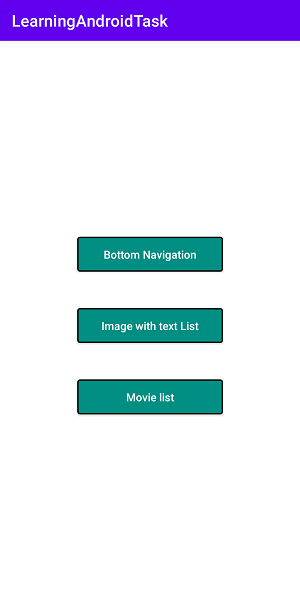

# LearningAndroidTask

## Overview

This app is created to learn android UI components like collapsing Toolbar, bottom navigation, navigation drawer, multiple views and views with Image and Text and also another UI  which loads movies from the TMDB api, and uses to show it in a RecyclerView.

## Libraries Used

•	Constraint Layout for UI designs

•	RecycleView to display List

•	CardView to display data as card

•	Navigation-Ui for navigation

•	Navigation-Fragment

•	Glide to display images

•	Gson to parse Json file

•	Retrofit to create network requests

Screenshots path "app/src/main/Screenshots/"

## App Screenshots

